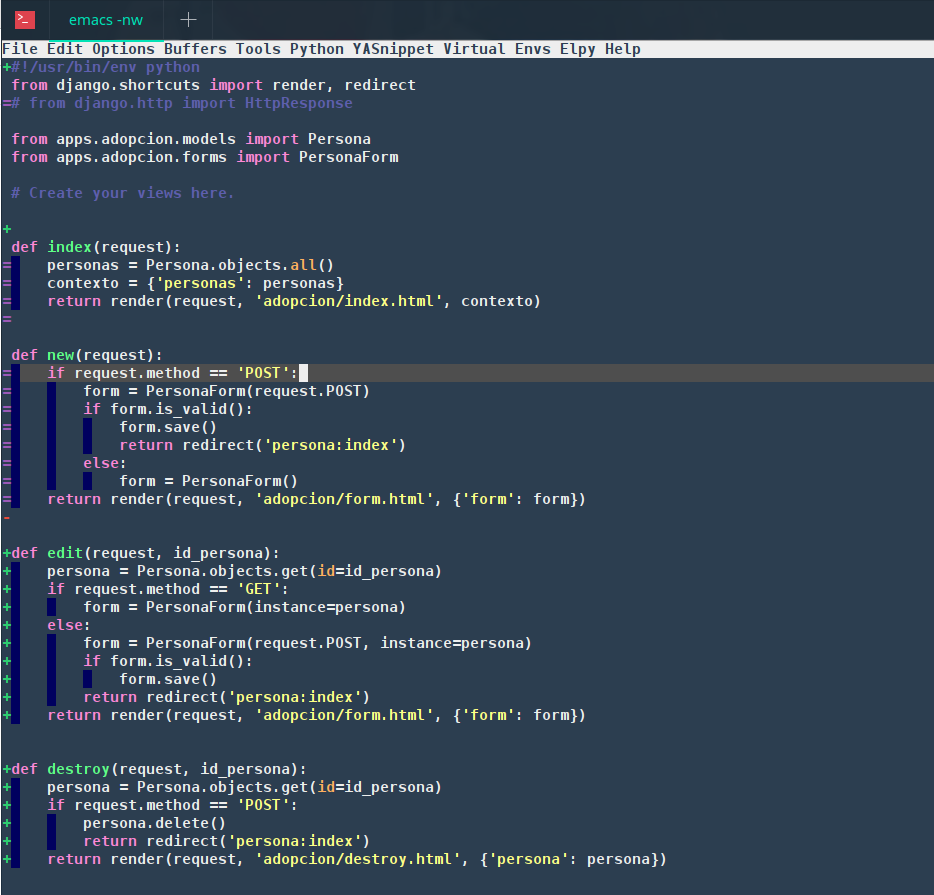

# Emacs Instalación Automática para consola  #

Esta es una recopilación de los paquetes básicos necesarios para poder programar a gusto usando la terminal con emacs.

Antes de la instalación debe tener instalado emacs 24 ó superior.

## Instalación  ##

    git clone git@github.com:bandagriss/emacs_config.git
    
**Preparando los archivos**

Para realizar el enlace simbolico no debe existir el archivo ~/.emacs y tampoco la carpeta ~/.emacs.d puede realizar un backup  de su configuración actual para no perderla y luego realizar lo siguiente.

    rm ~/.emacs
    rm -rf ~/.emacs.d
    
**Creando un enlace simbolico**

Entramos a emacs_config

    cd emacs_config
    
Luego creamos el enlace simbolico

    ln emacs ~/.emacs
    
Posteriormente ya podriamos abrir emacs 

    emacs mi_proyecto
    
Ó si no tiene instalada la version en consola

    emacs -nw mi_proyecto
    
El proceso de abrir puede durar varios minutos la primera vez ya que se descargaran los paquetes automaticamente.

## Paquetes del Sistema ##

Para que funcione correctamente debe tener instalado 

    sudo apt-get install silversearcher-ag
    sudo apt-get install xclip
    sudo pip install elpy jedi flake8 importmagic autopep8 yapf epc
    sudo apt-get install elpa-helm-projectile
    sudo apt-get install markdown
    sudo npm install -g eslint
    
### Extras ###
    
**Activando Yasnippet para modo web**

    mkdir ~/.emacs.d/elpa/yasnippet-0.12.2/snippets/web-mode
    
    echo "html-mode" >> ~/.emacs.d/elpa/yasnippet-0.12.2/snippets/web-mode/.yas-parents
    
*Creado por Roy*
